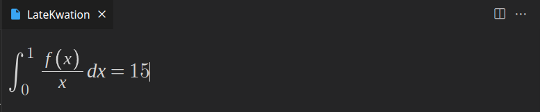

# Latekwation - WIP

VSCode extension aiming to make typing equations easier using an interactive panel.
Uses desmos mathquill fork

# Installation

## From VSIX package
- download latekwation-0.0.1.vsix
- hit Ctrl+Shift+P in vscode
- select Install from VSIX

# Usage

- bind a shortcut to the action "Open an interactive LaTeX panel"
- when using this shortcut, type your equation and see it take life, hit enter to copy it to your clipboard
- or escape to cancel and close the panel